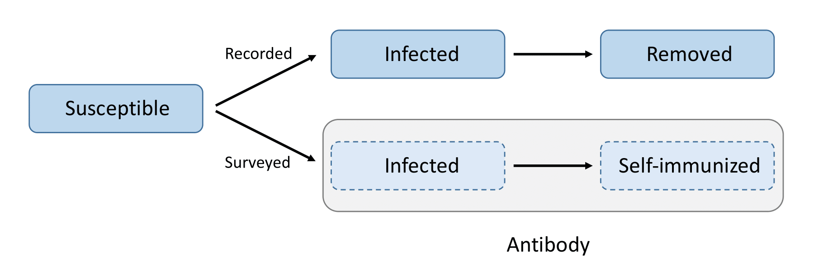
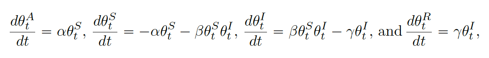

```{r setup, include=FALSE, echo=FALSE}
knitr::opts_chunk$set(collapse = TRUE,
                     comment = "#>",
                     fig.width=12, fig.height=8,
                     fig.path = "man/figures/README-",
                     file.path = "man/files/README-")

```

**Notice**: 

1. We add new features in `tvt.eSIR()`. Now the new function `tvt.eSIR2()` adds `time_unit` which will allow users to change their time unit from 1 day to any arbitrary numbers of days. 


2. Since version 0.3.1, we added the US data. The most recent update was on June 25th, 2021. We used data summarized from [JHU CSSE GitHub](https://github.com/CSSEGISandData/COVID-19) and [1Point3Acres](https://coronavirus.1point3acres.com). Only 41 states have complete recovery data. We will update the data every Thursday or Friday evening. Using following codes for the data:
```{r load data, eval = FALSE}
data("confirmed") # From JHU CSSE
data("death") # From JHU CSSE
data("recovered") # partly from 1Point3Acres
data("USA_state_N") #population in each state

```

3. Since version 0.3.3, we added Gelman-Rubin statistic for convergence check using [gelman.diag](https://www.rdocumentation.org/packages/coda/versions/0.19-3/topics/gelman.diag) from [`rjags`](https://cran.r-project.org/web/packages/rjags/index.html). Their values substantially larger than 1 imply a failure of convergence of the MCMC chains. Save it in a `.txt` file by setting `save_files = TRUE` or retrieve it via following R code (assuming that `res` is object returned from `tvt.eSIR` or `qh.eSIR`):

```r
res$gelman_diag_list
```


Chinese version:[中文](https://github.com/lilywang1988/eSIR/blob/master/README_cn.md)

## Purpose

The outbreak of novel Corona Virus disease (a.k.a. COVID-19), originated in Wuhan, the capital of Hubei Province spreads quickly and affects many cities in China as well as many countries in the world.  The Chinese government has enforced very stringent quarantine and inspection to prevent the worsening spread of COVID-19.  Although various forms of forecast on the turning points of this epidemic within and outside Hubei Province have been published in the media, none of the prediction models has explicitly accounted for the time-varying quarantine protocols. We extended the classical SIR model for infectious disease by incorporating forms of medical isolation (in-home quarantine and hospitalization) in the underlying infectious disease dynamic system.  Using the state-space model for both daily infected and hospitalized incidences and MCMC algorithms, we assess the effectiveness of quarantine protocols for confining COVID-19 spread in both Hubei Province and the other regions of China.  Both predicted turning points and their credible bands may be obtained from the extended SIR under a given quarantine protocol.  R software packages are also made publicly available for interested users.

The standard SIR model has three components: susceptible, infected, and removed (including the recovery and dead). In the following sections, we will introduce the other extended state-space SIR models and their implementation in the package. **The results provided below are based on relatively short chains.** According to our experience, this setting (`M=5e3` and `nburnin=2e3`) should provide acceptable results in terms of the trend and turning points estimation, the estimation of parameters and their credible intervals might not be accurate. Hence, if possible, we would recommend using `M=5e5` and `nburnin=2e5` to obtain stable MCMC chains via [`rjags`](https://cran.r-project.org/web/packages/rjags/index.html).  


## Preparation

[Download packages directly](https://github.com/lilywang1988/eSIR/blob/master/install_pkg)

To install and use this R package from Github, you will need to first install the R package `devtools`. Please uncomment the codes to install them. `eSIR` depends on three other packages, `rjags` (an interface to the JAGS library), `chron` and `gtools`, which could be installed with `eSIR` if not yet. 

An error may occur if you have not yet installed JAGS-4.x.y.exe (for any x >= 0, y >=0). **Windows** users may download and install JAGS from [here](http://www.sourceforge.net/projects/mcmc-jags/files). **Mac** users may follow steps  at [casallas/8411082](https://gist.github.com/casallas/8411082).


``` r
# install.packages("devtools")
# library(devtools)
# install_github("lilywang1988/eSIR")
library(eSIR) 
```

Our data are collected daily from [dxy.com](https://mama.dxy.com/outbreak/daily-of-nationwide-new?index=20200206&locationIds=999&from=todh5). Alternatively, we notice some convenient access to COVID-19 data from [GuangchuangYu/nCov2019](https://github.com/GuangchuangYu/nCov2019). 

For data outside China, we use [JHU CSSE GitHub](https://github.com/CSSEGISandData/COVID-19) data. Another package [coronavirus](https://github.com/RamiKrispin/coronavirus) has its GitHub version udpated daily, which is also quite useful. 

``` r
# Data of COVID-19 can be found in the following R packages: 
# install_github("GuangchuangYu/nCov2019")
#library(nCov2019) 
# install_github("qingyuanzhao/2019-nCov-Data")
#library(2019-nCov-Data) 
```

In Ubuntu (18.04) Linux, please first update R to a version >= 3.6. You may need to install jags package as well by  `sudo apt-get install jags`  before install devtools by `install.packages("devtools")`. [This](https://stackoverflow.com/questions/31114991/installation-of-package-devtools-had-non-zero-exit-status-on-ubuntu) stackoverflow question perfectly solved the issue I encountered when 
installing `devtools` on ubuntu. You may follow this [gist](https://gist.github.com/lilywang1988/170fbf1bbea1a6c23bc43a0dc871a0ca) to resolve other possible issues when installing `eSIR` on the recent version of Ubuntu. 


## Model 1 using `tvt.eSIR()`: a SIR model with a time-varying transmission rate

By introducing a time-dependent $$\pi(t)\in [0,1]$$ function that modifies the transmission rate $$\beta$$, we can depict a series of time-varying changes caused by either external variations like government policies, protective measures and environment changes, or internal variations like mutations and evolutions of the pathogen. 

The function can be either stepwise or exponential:


```{r model1}
set.seed(20192020)
library(eSIR)
# Hubei province data Jan13 -> Feb 11
# Cumulative number of infected cases
NI_complete <- c(
  41, 41, 41, 45, 62, 131, 200, 270, 375, 444, 549, 729,
  1052, 1423, 2714, 3554, 4903, 5806, 7153, 9074, 11177,
  13522,16678,19665,22112,24953,27100,29631,31728,33366
  )
# Cumulative number of removed cases
RI_complete <- c(
  1, 1, 7, 10, 14, 20, 25, 31, 34, 45, 55, 71, 94,
  121, 152, 213, 252, 345, 417, 561, 650, 811, 
  1017, 1261, 1485, 1917, 2260, 2725, 3284, 3754
  )
N <- 58.5e6
R <- RI_complete / N
Y <- NI_complete / N - R #Jan13->Feb 11

### Step function of pi(t)
change_time <- c("01/23/2020", "02/04/2020", "02/08/2020")
pi0 <- c(1.0, 0.9, 0.5, 0.1)
res.step <- tvt.eSIR(Y, 
                     R, 
                     begin_str = "01/13/2020",
                     T_fin = 200,
                     pi0 = pi0, 
                     change_time = change_time, 
                     dic = FALSE, 
                     casename = "Hubei_step", 
                     save_files = FALSE, 
                     save_mcmc = FALSE,
                     save_plot_data = TRUE, # can plot them
                     M = 5e3, 
                     nburnin = 2e3 # additional to M
                     )

res.step$plot_infection
res.step$plot_removed
res.step$spaghetti_plot


# If we change the time unit to 5 days
# Cumulative number of infected cases
NI_complete2 <- NI_complete[seq(1, length(NI_complete), 5)]
# Cumulative number of removed cases
RI_complete2 <- RI_complete[seq(1, length(RI_complete), 5)]
N2 <- 58.5e6
R2 <- RI_complete2 / N2
Y2 <- NI_complete2 / N2 - R2 #Jan13->Feb 11
change_time2 <- c("01/23/2020", "02/04/2020", "02/08/2020")
pi02 <- c(1.0, 0.9, 0.5, 0.1)
res.step2 <- tvt.eSIR2(Y2,
                       R2,
                       begin_str = "01/13/2020",
                       T_fin = 40,
                       pi0 = pi02,
                       change_time = change_time,
                       dic = FALSE,
                       casename = "Hubei_step2",
                       save_files = FALSE,
                       save_mcmc = FALSE,
                       save_plot_data = TRUE,
                       M = 5e3, 
                       nburnin = 2e3, 
                       time_unit = 5 #new feature!
                     )

res.step2$plot_infection
res.step2$plot_removed
res.step2$spaghetti_plot
res.step2$dic_val
#res.step$gelman_diag_list
### continuous exponential function of pi(t)
res.exp <- tvt.eSIR(Y, 
                    R,
                    begin_str = "01/13/2020", 
                    death_in_R = 0.4,
                    T_fin = 200, 
                    exponential = TRUE, 
                    dic = FALSE, 
                    lambda0 = 0.05,
                    casename = "Hubei_exp", 
                    save_files = FALSE, 
                    save_mcmc = FALSE,
                    save_plot_data = TRUE,
                    M = 5e3,
                    nburnin = 2e3)
  
res.exp$plot_infection
res.exp$spaghetti_plot
#res.exp$plot_removed

# Again, if we change our time unit to 5 days
res.exp2 <- tvt.eSIR2(Y2,
                      R2,
                      begin_str = "01/13/2020", 
                      death_in_R = 0.4,
                      T_fin = 200, 
                      exponential = TRUE, 
                      dic=FALSE,
                      lambda0 = 0.05,
                      casename = "Hubei_exp2",
                      save_files = FALSE, 
                      save_mcmc = FALSE,
                      save_plot_data = TRUE,
                      M = 5e3,
                      nburnin = 2e3,
                      time_unit = 5)

res.exp2$plot_infection
res.exp2$spaghetti_plot

### without pi(t), the standard state-space SIR model without intervention
res.nopi <- tvt.eSIR(Y, 
                     R, 
                     begin_str = "01/13/2020", 
                     death_in_R = 0.4, 
                     T_fin = 200, 
                     casename = "Hubei_nopi",
                     save_files = F,
                     save_plot_data = F,
                     M=5e3,nburnin = 2e3)
res.nopi$plot_infection
res.nopi$spaghetti_plot
#res.nopi$plot_removed
```


## Model 2 using `qh.eSIR()`: SIR with time-varying quarantine, which follows a Dirac Delta function

By introducing a vector of `phi` and its corresponding changing points `change_time`, we introduced a quarantine process that is dependent on a dirac delta function $\phi_t\in [0,1]$. In other words, only at time points defined by `change_time`, we have certain porportions of the at-risk (susceptible) subjects moved to the quarantine stage. The difference of this model than the previous time-varying transmission one is that we do not allow the tranmission rate to change, but only let the proportion of susceptible subjects decrease. 


```{r model2}
set.seed(20192020)
# Cumulative number of infected cases
NI_complete <- c( 
  41, 41, 41, 45, 62, 131, 200, 270, 375, 444,
  549, 729, 1052, 1423, 2714, 3554, 4903, 5806,
  7153, 9074, 11177, 13522, 16678, 19665, 22112,
  24953, 27100, 29631, 31728, 33366)
# Cumulative number of removed cases
RI_complete <- c(
  1, 1, 7, 10, 14, 20, 25, 31, 34, 45, 55, 
  71, 94, 121, 152, 213, 252, 345, 417, 561,
  650, 811, 1017, 1261, 1485, 1917, 2260,
  2725, 3284, 3754)
N <- 58.5e6
R <- RI_complete / N
Y <- NI_complete / N - R #Jan13->Feb 11

change_time <- c("01/23/2020", "02/04/2020", "02/08/2020")
phi0 <- c(0.1, 0.4, 0.4)
res.q <- qh.eSIR(Y, 
                 R, 
                 begin_str = "01/13/2020",
                 phi0 = phi0,
                 change_time = change_time,
                 casename = "Hubei_q", 
                 save_files = TRUE,
                 save_mcmc = FALSE,
                 save_plot_data = FALSE,
                 M = 5e3,
                 nburnin = 2e3)
res.q$plot_infection
```

You will obtain the following plot in addition to the traceplots and summary table if you set `save_file=T` in `qh.eSIR`. The blue vertical line denotes the beginning date, and the other three gray lines denote the three change points. 


## Model 3 using `eSAIR`: SIR with time-varying subset of population immunized with antibody positivity

To address the under-reporting issue associated with the available public databases and to build the self-immunization into the infection dynamics, we then further extend the previous eSIR model to an eSAIR model by adding an antibody (A) compartment. As is shown in the bottom thread of the following figure, this A compartment accounts for the probability of being self-immunized with antibodies to COVID-19, denoted by $\theta_t^A$; see equation as follows too, where $\alpha(t)$ is a function describing the proportion of people moving from the susceptible compartment to the antibody compartment over time. Compartment A helps circumvent limitations of data collection, especially embracing individuals who were infected but self-cured at home with no confirmation by viral RT-PCR diagnostic tests. This new eSAIR model characterizes the underlying population-level dynamics of the pandemic. The following system of ordinary differential equations defines collectively the continuous-time dynamics for the eSAIR model, which governs the law of movements among four compartments of Susceptible, Self-immunized, Infected and Removed. 





In the example below, we implemented this function onto New York state data assuming that by April 29, 20% of the population have been self-immunized with antibody positivity.

```{r model 3}
# Cumulative number of infected cases
NI_complete <- c( 
  1, 2, 11, 23, 31, 76, 106, 142, 150, 220, 327,
  421, 613, 615, 967, 1578, 3038, 5704, 8403,
  11727, 15800, 20884, 25681, 30841, 37877,
  44876, 52410, 59648, 66663, 75833, 83948,
  92506, 102987, 113833, 123160, 131815,
  139875, 151061, 161779, 172348, 181026,
  189033, 195749, 203020, 214454, 223691,
  230597, 237474, 243382, 248416, 253519,
  258222, 263460, 271590, 282143, 288045,
  291996, 295106, 299691, 304372, 308314)
# Cumulative number of removed cases
RI_complete <- c(
  0, 0, 0, 0, 0, 0, 0, 0, 0, 0, 1, 2, 
  20, 26, 38, 52, 200, 311, 468, 662,
  893, 1144, 1547, 2144, 2931, 3900, 
  5133, 6201, 7657, 9483, 11536,
  13915, 16276, 18781, 21110, 23424,
  26469, 29784, 32899, 35785, 37730,
  39207, 40703, 42164, 43488, 44723, 
  45887, 47473, 47686, 48769, 49572,
  50221, 52161, 52917, 54115, 54613,
  55473, 55816, 56809, 57265, 58525)
N <- 8.399e6
R <- RI_complete / N
Y <- NI_complete / N - R 

change_time <- c("04/29/2020")
alpha0 <- c(0.2) # 20% of the susceptible population were found immunized
res.antibody <- eSAIR(Y,
                      R, 
                      begin_str = "03/01/2020",
                      alpha0 = alpha0, 
                      change_time = change_time,
                      casename = "New_York_antibody", 
                      save_files = F, 
                      save_mcmc = F, 
                      M=5e2, 
                      nburnin = 2e2)
res.antibody$plot_infection


```


## Outputs and summary table

To save all the plots (including trace plots) and summary tables, please set `save_files=T`, and if possible, provide a location by setting `file_add="YOUR/FAVORITE/FOLDER"`. Otherwise, the traceplots and other intermediate plots will not be saved, but you can still retrieve the forecast plots and summary table based on the return list, e.g., using `res.step$forecast_infection` and `res.step$out_table`. Moreover, if you are interested in plotting the figures on your own, you may set `save_mcmc=T` so that all the MCMC draws will be saved in a `.RData` file too. 

For details, please explore our package directly. We have `.rd` files established, please use `help(tvt.eSIR)` or `?qh.eSIR` to find them. 

## Acknowledgements
This package is created and maintained by [Lili Wang](lilywang@umich.edu), contributed by [Fei Wang](https://github.com/feiwsteven), [Lu Tang](https://github.com/ClumsyBear), and [Paul Egeler](https://github.com/pegeler). We also thank [Kangping Yang](kangpiny@umich.edu) for helping us collect the recovery data from the web page. 


## References

1. Wang, L., Zhou, Y., He, J., Zhu, B., Wang, F., Tang, L., ... & Song, P. X. (2020). An epidemiological forecast model and software assessing interventions on the COVID-19 epidemic in China. Journal of Data Science, 18(3), 409-432. [link](https://www.airitilibrary.com/Publication/alDetailedMesh?DocID=16838602-202007-202008240002-202008240002-409-432&sourceBrowseType=0)

2. Osthus, D., Hickmann, K. S., Caragea, P. C., Higdon, D., & Del Valle, S. Y. (2017). Forecasting seasonal influenza with a state-space SIR model. The annals of applied statistics, 11(1), 202.

3. Gelman, A., & Rubin, D. B. (1992). Inference from iterative simulation using multiple sequences. Statistical science, 7(4), 457-472.

-----------
Shield: [![CC BY 4.0][cc-by-shield]][cc-by]

This work is licensed under a [Creative Commons Attribution 4.0 International
License][cc-by].

[![CC BY 4.0][cc-by-image]][cc-by]

[cc-by]: http://creativecommons.org/licenses/by/4.0/
[cc-by-image]: https://i.creativecommons.org/l/by/4.0/88x31.png
[cc-by-shield]: https://img.shields.io/badge/License-CC%20BY%204.0-lightgrey.svg

