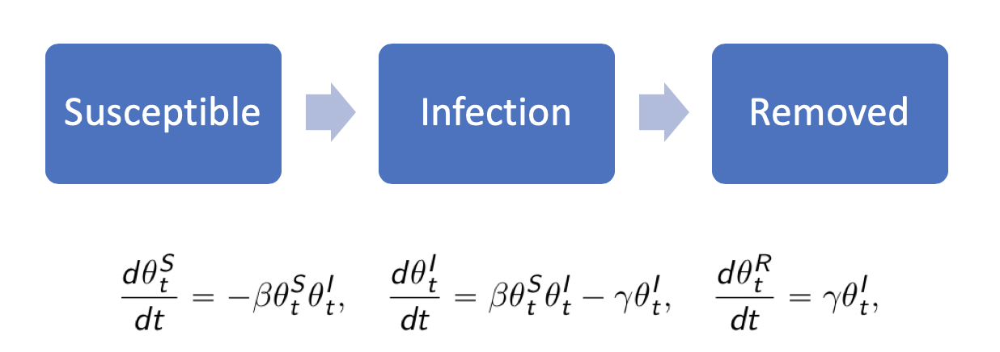

R package eSIR: An extended SIR epidemiological model
================
[Song Lab](http://www.umich.edu/~songlab/)
2020-02-14

Purpose
-------

The outbreak of novel Corona Virus disease (a.k.a. COVID-19), originated in Wuhan, the capital of Hubei Province spreads quickly and affects many cities in China as well as many countries in the world. The Chinese government has enforced very stringent quarantine and inspection to prevent the worsening spread of COVID-19. Although various forms of forecast on the turning points of this epidemic within and outside Hubei Province have been published in the media, none of the prediction models has explicitly accounted for the time-varying quarantine protocols. We extended the classical SIR model for infectious disease by incorporating forms of medical isolation (in-home quarantine and hospitalization) in the underlying infectious disease dynamic system. Using the state-space model for both daily infected and hospitalized incidences and MCMC algorithms, we assess the effectiveness of quarantine protocols for confining COVID-19 spread in both Hubei Province and the other regions of China. Both predicted turning points and their credible bands may be obtained from the extended SIR under a given quarantine protocol. R software packages are also made publicly available for interested users.

The standard SIR model has three components: susceptible, infected, and removed (including the recovery and dead). In the following sections, we will introduce the other extended state-space SIR models and their implementation in the package. *All the results provided are based on very short chains.* Please set at least `M=5e5` and `nburnin=2e5` to obtain stable MCMC chains via [`rjags`](https://cran.r-project.org/web/packages/rjags/index.html).



Preparation
-----------

To install and use this R package from Github, you will need to install another R package "devtools". Please uncomment the codes to install them. We notice some convenient access to the COVID-19 from [GuangchuangYu/nCov2019](https://github.com/GuangchuangYu/nCov2019) and [qingyuanzhao/2019-nCov-Data](https://github.com/qingyuanzhao/2019-nCov-Data).

``` r
# install.packages("devtools")
# library(devtools)

#for information and covariance calculation; sample size computation using Hasegawa proposal
# install_github("lilywang1988/eSIR")
library(eSIR) 

# Data of COVID-19 can be found in the following R packages: 
# install_github("GuangchuangYu/nCov2019")
#library(nCov2019) 
# install_github("qingyuanzhao/2019-nCov-Data")
#library(2019-nCov-Data) 
```

In Ubuntu (18.04) Linux, please first update R to a version >= 3.6. You many need to install jags package as well by  "sudo apt-get install jags"  before install devtools by "install.packages("devtools")". 


Model 1 using `pi.SIR()`: a SIR model with a time-varying transmission rate
---------------------------------------------------------------------------

By introducing a time-dependent $\\pi\_\\bar{q}(t)\\in \[0,1\]$ function that multiplies the transmission rate $\beta$, we can depict a series of time-varying changes caused by either external variations like government policies, protective measures and environment changes, or internal variations like mutations and evolutions of the pathogen.

The function can be either stepwise or exponential:
$$
\\pi\_\\bar{q}(t)=\\sum\_{k=1}^K \\pi\_{k}I(t\\in\[t\_k,t\_{k+1}))
$$
 and
$$
\\pi\_\\bar{q}(t)=\\exp(-\\lambda\_0t)
$$


``` r
set.seed(20192020)
NI_complete <- c( 41,41,41,45,62,131,200,270,375,444,549, 729,1052,1423,2714,3554,4903,5806,7153,9074,11177,13522,16678,19665,22112,24953,27100,29631,31728,33366)
  RI_complete <- c(1,1,7,10,14,20,25,31,34,45,55,71,94,121,152,213,252,345,417,561,650,811,1017,1261,1485,1917,2260,2725,3284,3754)
  N=58.5e6
  R <- RI_complete/N
  Y <- NI_complete/N- R #Jan13->Feb 11
  ### Step function of pi_qbar(t)
  change_time <- c("01/23/2020","02/04/2020","02/08/2020")
  pi_qbar0 <- c(1.0,0.9,0.5,0.1)
  res.step <-pi.SIR(Y,R,begin_str="01/13/2020",T_fin=200,pi_qbar0=pi_qbar0,change_time=change_time,casename="Hubei_step",save_files = T)
#> The follow-up is from 01/13/20 to 07/30/20 and the last observed date is 02/11/20.
#> Running for step-function pi_qbar(t)
#> Compiling model graph
#>    Resolving undeclared variables
#>    Allocating nodes
#> Graph information:
#>    Observed stochastic nodes: 60
#>    Unobserved stochastic nodes: 37
#>    Total graph size: 1873
#> 
#> Initializing model
#> Saving 12 x 8 in image
#> Saving 12 x 8 in image
  res.step$forecast_infection
```


``` r
  
  ### continuous exponential function of pi_qbar(t)
  res.exp <- pi.SIR(Y,R,begin_str="01/13/2020",T_fin=200,pi_qbar0=pi_qbar0,change_time=change_time,exponential=TRUE,lambda0=0.01,casename="Hubei_exp")
#> The follow-up is from 01/13/20 to 07/30/20 and the last observed date is 02/11/20.
#> Running for exponential-function pi_qbar(t)
#> Compiling model graph
#>    Resolving undeclared variables
#>    Allocating nodes
#> Graph information:
#>    Observed stochastic nodes: 60
#>    Unobserved stochastic nodes: 37
#>    Total graph size: 1873
#> 
#> Initializing model
  res.exp$forecast_infection
```


``` r
  
  ### without pi_qbar(t)
  res.nopi <- pi.SIR(Y,R,begin_str="01/13/2020",T_fin=200,casename="Hubei_nopi")
#> The follow-up is from 01/13/20 to 07/30/20 and the last observed date is 02/11/20.
#> Running without pi_qbar(t)
#> Compiling model graph
#>    Resolving undeclared variables
#>    Allocating nodes
#> Graph information:
#>    Observed stochastic nodes: 60
#>    Unobserved stochastic nodes: 37
#>    Total graph size: 1873
#> 
#> Initializing model
  res.nopi$forecast_infection
```


Model 2 using `q.SIR()`: SIR with time-varying quarantine, which follows a Dirac Delta function
-----------------------------------------------------------------------------------------------

By introducing a vector of `phi` and its corresponding changing points `change_time`, we introduced a quarantine process that is dependent on a dirac delta function *ϕ*(*t*)∈\[0, 1\]. In other words, only at time points defined by `change_time`, we have certain porportions of the at-risk (susceptible) subjects moved to the quarantine stage. The difference of this model than the previous time-varying transmission one is that we do not allow the tranmission rate to change, but only let the proportion of susceptible subjects decrease. 

$$
\\phi(t)=\\left\\{\\begin{array}{c l}
\\phi\_k & t=t\_k;\\\\
0& o.w. 
\\end{array}  \\right.
$$

``` r
  set.seed(20192020)
  change_time <- c("01/23/2020","02/04/2020","02/08/2020")
  phi <- c(0.1,0.4,0.4)
  res.q <- q.SIR (Y,R,begin_str="01/13/2020",T_fin=200,phi=phi,change_time=change_time,casename="Hubei_q")
#> The follow-up is from 01/13/20 to 07/30/20 and the last observed date is 02/11/20.
#> Running for q.SIR
#> Compiling model graph
#>    Resolving undeclared variables
#>    Allocating nodes
#> Graph information:
#>    Observed stochastic nodes: 60
#>    Unobserved stochastic nodes: 37
#>    Total graph size: 2676
#> 
#> Initializing model
  res.q$forecast_infection
```


``` r
  
  # The following codes provide identical result as the one fron res.nopi in pi.SIR
  #res.noq <- q.SIR (Y,R,begin_str="01/13/2020",T_fin=200,casename="Hubei_noq")
  #res.noq$forecast_infection
```

Following the uncommented codes we obtain following the plot in your working directory: 

Outputs and summary table
-------------------------

To save all the plots (including trace plots) and summary tables, please set `save_files=T`, and if possible, provide a location by setting `file_add="YOUR/FAVORITE/FOLDER"`. Otherwise, the traceplots and other intermediate plots will not be saved, but you can still retrieve the forecast plots and summary table based on the return list, e.g., using `res.step$forecast_infection` and `res.step$out_table`.

For details, please explore our package directly. We have .rd files establisehd, please use `help(q.SIR)` or `?pi.SIR` to find them.

References
----------

1.  Osthus, D., Hickmann, K. S., Caragea, P. C., Higdon, D., & Del Valle, S. Y. (2017). Forecasting seasonal influenza with a state-space SIR model. The annals of applied statistics, 11(1), 202.

2.  Mkhatshwa, T., & Mummert, A. (2010). Modeling super-spreading events for infectious diseases: case study SARS. arXiv preprint arXiv:1007.0908.
